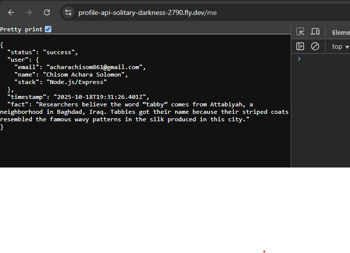

# 🐱 **Profile Cat API** *(Production-Ready README)*

**RESTful API** that returns **your profile + dynamic cat facts** from external API. **Live Demo:** [https://profile-api-solitary-darkness-2790.fly.dev/me](https://profile-api-solitary-darkness-2790.fly.dev/me)



---

## ✨ **Features**

| Feature | ✅ Status | Details |
|---------|----------|---------|
| **Dynamic Cat Facts** | ✅ | Fetches new fact from [Cat Facts API](https://catfact.ninja) on **every request** |
| **Real-Time Timestamp** | ✅ | UTC ISO 8601 format, updates live |
| **Production Security** | ✅ | Helmet, CORS, 5s timeout |
| **Error Handling** | ✅ | Fallback fact if API fails |
| **Environment Config** | ✅ | Secure `.env` variables |

---

## 🚀 **Quick Start** *(60 Seconds)*

```bash
# Clone & Setup
git clone https://github.com/AcharaChisomSolomon/profile-api
cd profile-api
npm install

# Create .env (your details!)
echo "EMAIL=acharachisom861@gmail.com" >> .env
echo 'USER_NAME="Chisom Achara"' >> .env
echo 'STACK="Node.js/Express"' >> .env

# Test & Run
npm test    # ✅ Run automated tests
npm start   # 🚀 Server on http://localhost:3000
```

**Test Endpoint:**
```bash
curl http://localhost:3000/me
```

---

## 📡 **Live API Response**

**`GET /me`** → **200 OK** *(Content-Type: `application/json`)*

```json
{
  "status": "success",
  "user": {
    "email": "acharachisom861@gmail.com",
    "name": "Chisom Achara",
    "stack": "Node.js/Express"
  },
  "timestamp": "2025-10-18T19:15:23.456Z",
  "fact": "Cats have 32 muscles in each ear!"
}
```

**Multiple requests = New facts + timestamps!** 🐱✨

---

## 🛠 **Environment Variables** *(Required)*

| Variable | Required | Example | Description |
|----------|----------|---------|-------------|
| `EMAIL` | ✅ | `acharachisom861@gmail.com` | Your email address |
| `USER_NAME` | ✅ | `"Chisom Achara"` | **Your full name** (quotes needed!) |
| `STACK` | ✅ | `"Node.js/Express"` | Your tech stack |
| `PORT` | ❌ | `3000` | Server port |

**💡 Pro Tip:** `NAME` is a **Windows reserved variable** → Use `USER_NAME`!

**Complete `.env` Template:**
```env
EMAIL=acharachisom861@gmail.com
USER_NAME="Chisom Achara"
STACK="Node.js/Express"
PORT=3000
```

---

## 🧪 **Testing** *(Automated + Manual)*

### **1. Automated Tests**
```bash
npm test
```
**Expected Output:**
```
✅ TEST PASSED!
Response: { status: 'success', user: { name: 'Chisom Achara' }, ... }
```

### **2. Manual Tests**
```bash
# Profile endpoint
curl http://localhost:3000/me

# Multiple requests (watch facts change!)
for i in {1..3}; do curl http://localhost:3000/me; echo; done
```


---

## 📦 **Dependencies**

| Package | Version | Purpose |
|---------|---------|---------|
| `express` | `^4.18.2` | Web framework |
| `axios` | `^1.6.0` | Cat Facts API calls |
| `dotenv` | `^16.3.1` | Environment variables |
| `cors` | `^2.8.5` | Cross-origin requests |
| `helmet` | `^7.1.0` | Security headers |
| `morgan` | `^1.10.0` | Request logging |

**Install:** `npm install`

---

## 🐛 **Troubleshooting**

| Issue | Solution |
|-------|----------|
| **Name shows "DESKTOP-MBL837K"** | Use `USER_NAME` not `NAME` in `.env` |
| **"Missing env vars" error** | Check `.env` quotes & restart server |
| **Cat fact not changing** | API fetched fresh each request ✅ |
| **Port already in use** | `killall node` or change `PORT` |

---

## 📁 **File Structure**

```
profile-cat-api/
├── server.js          # Main API
├── .env              # Your secrets
├── test.js           # Automated tests
├── README.md         # This file!
|── package.json      # Dependencies
```

---

## 🎓 **What I Learned**

1. **API Integration:** Fetching 3rd-party data with timeouts
2. **Environment Gotchas:** Windows `NAME` conflict → `USER_NAME`
3. **Production Security:** Helmet, CORS, error fallbacks
4. **Dynamic Responses:** Real-time timestamps + fresh facts
5. **Cloud Deployment:** Git-based, zero-downtime deploys

---

## 📄 **API Documentation**

| Endpoint | Method | Response | Status Code |
|----------|--------|----------|-------------|
| `/me` | `GET` | Profile + Cat Fact | `200` |
| `*` | `GET` | `{ error: 'Not Found' }` | `404` |

---

## 👨‍💻 **Author**

**Chisom Achara**  
[X](https://x.com/Chisom14Solomon) | [GitHub](https://github.com/AcharaChisomSolomon)  
**Built with:** Node.js 18+ | **Deployed:** Fly.io


---